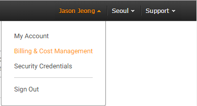
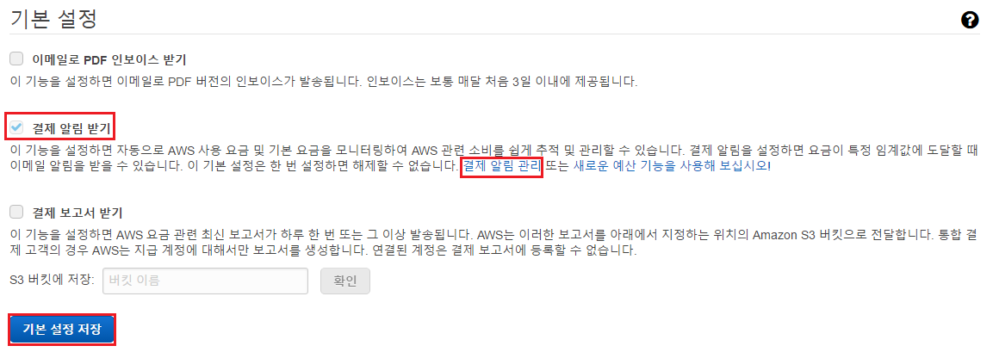
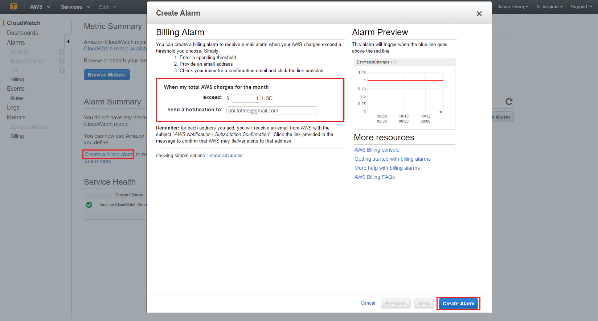

# AWS를 사용하여 각종 서버 환경 구축하기

## 앞서
github markdown의 문제로 새창열림 링크를 만들 수 없음. 새창이 열리는 페이지는 ctrl + 클릭으로 열길 바랍니다.

## AWS 란?
아마존에서 제공하는 클라우드 컴퓨팅으로 다양한 제품군들을 지원하여 클라우드에서 서버환경 및 저장소 등을 자유롭게 구축할수 있다.

## AWS 가입하기

- [가입하기](https://portal.aws.amazon.com/billing/signup?nc2=h_ct&redirect_url=https%3A%2F%2Faws.amazon.com%2Fregistration-confirmation&language=ko_kr)

- 추가요금 방지를 위한 기본 설정

AWS는 유료이지만 프리티어로 1년간 체험해볼 수 있는 기회를 제공한다.
1년 뒤 또는 그 전에 트래픽 과다로 인한 요금지불 방지를 위해 몇가지 설정이 필요하다.

1. 로그인 한 후 내 계정 -> AWS Management Console

2. 이름 클릭 -> Billing & Cost Management

3. 기본 설정 -> 결제 알림 받기 -> 기본 설정 저장 -> 결제 알림 관리

4. Create Alarm -> exceed / mail 설정 후 완료 및 mail confirm

