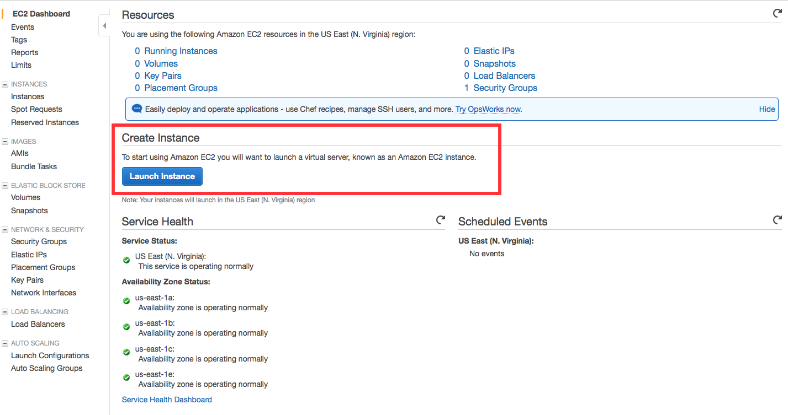

# AWS 각종 서버

## 앞서
github markdown의 문제로 새창열림 링크를 만들 수 없음. 새창이 열리는 페이지는 ctrl + 클릭으로 열길 바랍니다.

---

## AWS 란?
아마존에서 제공하는 클라우드 컴퓨팅으로 다양한 제품군들을 지원하여 클라우드에서 서버환경 및 저장소 등을 자유롭게 구축할수 있다.

---

## AWS 가입 및 계정 설정

- [가입하기](https://portal.aws.amazon.com/billing/signup?nc2=h_ct&redirect_url=https%3A%2F%2Faws.amazon.com%2Fregistration-confirmation&language=ko_kr)

- 추가요금 방지를 위한 기본 설정

AWS는 유료이지만 프리티어로 1년간 체험해볼 수 있는 기회를 제공한다.
1년 뒤 또는 그 전에 트래픽 과다로 인한 요금지불 방지를 위해 몇가지 설정이 필요하다.

1. 로그인 한 후 내 계정 -> AWS Management Console

2. 이름 클릭 -> Billing & Cost Management  

3. 기본 설정 -> 결제 알림 받기 -> 기본 설정 저장 -> 결제 알림 관리  

4. Create Alarm -> exceed / mail 설정 후 완료 및 mail confirm  

---

## AWS Free Tier 사용하기

### EC2 (Elastic Computing Cloud)

#### EC2를 이용해 리눅스 VM 만들기

1. AWS Management Console에 접속하여 EC2 선택

2. 상단의 이름 옆에 자신에 맞는 region을 선택한 후 Launch Instance 클릭

3. Amazone Linux AMI 선택 / t2.micro 선택 (나중에 우분투로 바꿨습니다. 우분투 짱짱맨)
  

4. Create a new key pair 로 pem 생성 후 view instances

#### EC2 인스턴스 접속하기

Windows : [Git Bash](https://git-scm.com/download/win) / [PuTTY](http://www.chiark.greenend.org.uk/~sgtatham/putty/download.html) 로 접속

생성된 pem 파일을 PuTTYgen 을 이용하여 ppk 파일로 생성

File -> Load Private Key -> 모든파일 -> 다운받은 pem 파일 클릭 -> Save private Key 클릭

Putty 설정

Host Name에 ubuntu@{EC2에 생성된 퍼블릭 DNS} (@앞 계정은 설치한 인스턴스의 OS마다 다름)

좌측의 Connection -> SSH -> Auth 의 Private Key에 위에서 생성한 ppk 파일 링크하면 접속 성공!
